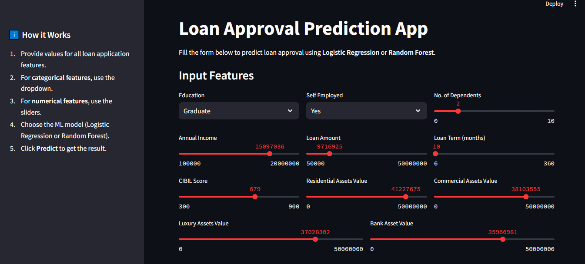
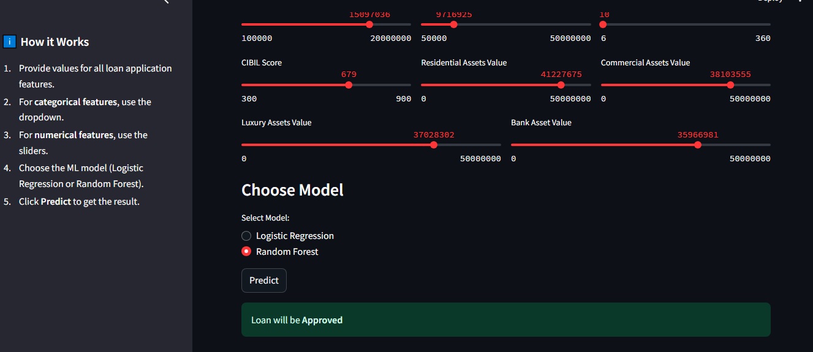

#  Loan Approval Prediction Web App

##  Project Overview
This project is a **Loan Approval Prediction Web App** built with **Streamlit**.  
It allows users to input applicant details (categorical & numerical features) and predicts loan approval using **Logistic Regression** or **Random Forest** models.

---

##  Features
- **Categorical Inputs**: Dropdowns for Gender, Married, Education, etc.  
- **Numerical Inputs**: Sliders for Age, Income, Loan Amount, etc.  
- **Multiple Models**: Choose between Logistic Regression or Random Forest.  
- **Interactive UI**: Clean interface with sidebar instructions.  

---

##  Dataset
The model was trained on a loan dataset containing applicant details such as:
- Gender  
- Married  
- Education  
- Applicant Income  
- Loan Amount  
- Loan Status  

---

##  Tech Stack
- **Python**  
- **Pandas, NumPy**  
- **Scikit-learn (ML Models, Preprocessing)**  
- **Joblib (Model Saving/Loading)**  
- **Streamlit (Web App)**  

---

##  How to Run Locally
1. Clone this repository:
   ```bash
   git clone https://github.com/kinzarani1234/loan-approval-prediction-web-app.git
   cd loan-approval-prediction-web-app

## Install dependencies:

pip install -r requirements.txt


## Run the app:

streamlit run app.py   


## Author

Developed by Kinza Rani


